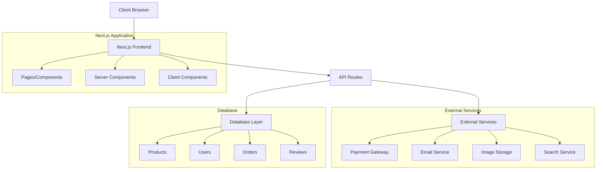
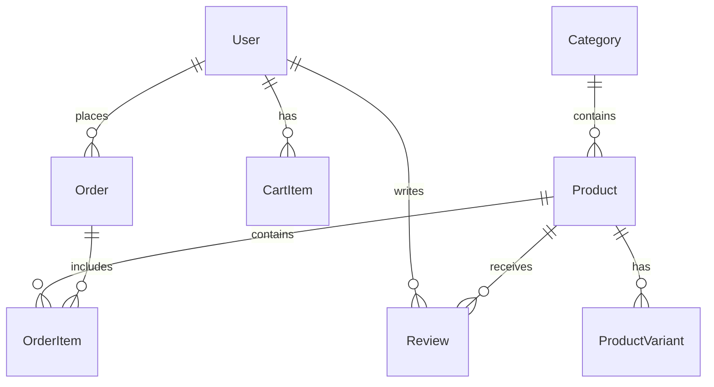

# Fashion Ecommerce Platform Design Document

## Overview

This design document outlines the architecture for a modern fashion ecommerce platform built with Next.js 15, React 19, and Tailwind CSS. The platform will provide a scalable, performant, and user-friendly shopping experience similar to Jumia, focusing on fashion items including clothing, shoes, and accessories.

The architecture follows modern web development best practices with server-side rendering, API routes, and a component-based design system. The platform will be mobile-first, SEO-optimized, and designed for high performance and scalability.

## Architecture

### High-Level Architecture



### Technology Stack

- **Frontend Framework**: Next.js 15 with App Router
- **UI Library**: React 19 with Server Components
- **Styling**: Tailwind CSS 4
- **Database**: MongoDB with Mongoose ODM
- **Authentication**: NextAuth.js
- **Payment Processing**: Paystack
- **Image Storage**: Cloudinary
- **Search**: Meilisearch (self-hosted)
- **Email**: AWS SES
- **Deployment**: Vercel

### Folder Structure

```
app/
├── (auth)/
│   ├── login/
│   └── register/
├── (shop)/
│   ├── products/
│   ├── category/
│   └── search/
├── cart/
├── checkout/
├── account/
│   ├── orders/
│   ├── profile/
│   └── wishlist/
├── admin/
├── api/
│   ├── products/
│   ├── users/
│   ├── orders/
│   ├── payments/
│   └── reviews/
├── components/
│   ├── ui/
│   ├── product/
│   ├── cart/
│   └── layout/
├── lib/
│   ├── db/
│   ├── auth/
│   ├── paystack/
│   ├── meilisearch/
│   ├── aws-ses/
│   ├── utils/
│   └── validations/
└── types/
```

## Components and Interfaces

### Core Components

#### 1. Product Components
- **ProductCard**: Displays product preview with image, name, price, rating
- **ProductGrid**: Responsive grid layout for product listings
- **ProductDetails**: Full product page with images, description, variants
- **ProductImageGallery**: Interactive image viewer with zoom functionality
- **ProductVariantSelector**: Size, color, and other variant selection
- **ProductReviews**: Customer reviews and rating display

#### 2. Navigation Components
- **Header**: Main navigation with search, cart, user menu
- **CategoryNav**: Category navigation with mega menu
- **Breadcrumbs**: Navigation breadcrumb trail
- **Footer**: Site footer with links and information
- **MobileNav**: Mobile-optimized navigation drawer

#### 3. Shopping Components
- **CartDrawer**: Slide-out cart with item management
- **CartItem**: Individual cart item with quantity controls
- **CheckoutForm**: Multi-step checkout process
- **PaymentForm**: Secure payment information collection
- **OrderSummary**: Order details and pricing breakdown

#### 4. User Interface Components
- **SearchBar**: Product search with autocomplete
- **FilterSidebar**: Product filtering options
- **PaginationControls**: Page navigation for product listings
- **LoadingSpinner**: Loading states for async operations
- **ErrorBoundary**: Error handling and display
- **Toast**: Notification system for user feedback

### API Interfaces

#### Product API
```typescript
interface Product {
  id: string
  name: string
  description: string
  price: number
  images: string[]
  category: Category
  brand: string
  variants: ProductVariant[]
  inventory: number
  rating: number
  reviewCount: number
  createdAt: Date
  updatedAt: Date
}

interface ProductVariant {
  id: string
  size?: string
  color?: string
  sku: string
  price?: number
  inventory: number
}
```

#### User API
```typescript
interface User {
  id: string
  email: string
  name: string
  phone?: string
  addresses: Address[]
  orders: Order[]
  wishlist: Product[]
  createdAt: Date
}

interface Address {
  id: string
  street: string
  city: string
  state: string
  zipCode: string
  country: string
  isDefault: boolean
}
```

#### Order API
```typescript
interface Order {
  id: string
  userId: string
  items: OrderItem[]
  subtotal: number
  tax: number
  shipping: number
  total: number
  status: OrderStatus
  shippingAddress: Address
  paymentMethod: PaymentMethod
  trackingNumber?: string
  createdAt: Date
}

interface OrderItem {
  productId: string
  variantId?: string
  quantity: number
  price: number
}
```

## Data Models

### Database Schema (MongoDB Collections)

#### Products Collection
```javascript
{
  _id: ObjectId,
  name: String,
  description: String,
  price: Number,
  images: [String],
  category: ObjectId, // Reference to Category
  brand: String,
  variants: [{
    size: String,
    color: String,
    sku: String,
    price: Number,
    inventory: Number
  }],
  inventory: Number,
  rating: Number,
  reviewCount: Number,
  searchableText: String, // For Meilisearch indexing
  createdAt: Date,
  updatedAt: Date
}
```

#### Users Collection
```javascript
{
  _id: ObjectId,
  email: String,
  name: String,
  phone: String,
  password: String, // Hashed
  addresses: [{
    street: String,
    city: String,
    state: String,
    zipCode: String,
    country: String,
    isDefault: Boolean
  }],
  wishlist: [ObjectId], // Product references
  emailVerified: Boolean,
  createdAt: Date,
  lastLogin: Date
}
```

#### Orders Collection
```javascript
{
  _id: ObjectId,
  userId: ObjectId,
  items: [{
    productId: ObjectId,
    variantId: String,
    quantity: Number,
    price: Number,
    name: String // Snapshot for order history
  }],
  subtotal: Number,
  tax: Number,
  shipping: Number,
  total: Number,
  status: String, // pending, confirmed, shipped, delivered, cancelled
  paymentStatus: String, // pending, paid, failed, refunded
  paystackReference: String,
  shippingAddress: Object,
  trackingNumber: String,
  createdAt: Date,
  updatedAt: Date
}
```

#### Reviews Collection
```javascript
{
  _id: ObjectId,
  userId: ObjectId,
  productId: ObjectId,
  orderId: ObjectId, // For verified purchase
  rating: Number,
  title: String,
  comment: String,
  isVerifiedPurchase: Boolean,
  moderationStatus: String, // pending, approved, rejected
  helpfulVotes: Number,
  createdAt: Date
}
```

### Data Relationships



## Error Handling

### Client-Side Error Handling
- React Error Boundaries for component-level errors
- Form validation with real-time feedback
- Network error handling with retry mechanisms
- User-friendly error messages and recovery options

### Server-Side Error Handling
- API route error middleware for consistent error responses
- Database connection error handling and retry logic
- Payment processing error handling with detailed logging
- Rate limiting and abuse prevention

### Error Types and Responses
```typescript
interface APIError {
  code: string
  message: string
  details?: any
  timestamp: Date
}

// Common error codes
enum ErrorCodes {
  VALIDATION_ERROR = 'VALIDATION_ERROR',
  NOT_FOUND = 'NOT_FOUND',
  UNAUTHORIZED = 'UNAUTHORIZED',
  PAYMENT_FAILED = 'PAYMENT_FAILED',
  INVENTORY_INSUFFICIENT = 'INVENTORY_INSUFFICIENT',
  SERVER_ERROR = 'SERVER_ERROR'
}
```

## Testing Strategy

### Unit Testing
- Component testing with React Testing Library
- API route testing with Jest and supertest
- Database model testing with test database
- Utility function testing for business logic

### Integration Testing
- End-to-end user flows with Playwright
- Payment processing integration tests
- Email delivery testing
- Search functionality testing

### Performance Testing
- Page load speed optimization
- Database query performance monitoring
- Image optimization and lazy loading
- Core Web Vitals monitoring

### Testing Structure
```
__tests__/
├── components/
├── pages/
├── api/
├── utils/
└── e2e/
    ├── auth.spec.ts
    ├── shopping.spec.ts
    ├── checkout.spec.ts
    └── admin.spec.ts
```

### Security Considerations
- Input validation and sanitization
- NoSQL injection prevention with proper query sanitization
- XSS protection with proper data encoding
- CSRF protection with tokens
- Rate limiting on API endpoints
- Secure session management
- Paystack webhook signature verification
- AWS SES credential security
- Meilisearch API key protection
- Regular security audits and dependency updates

### Performance Optimizations
- Server-side rendering for SEO and initial load speed
- Image optimization with next/image and Cloudinary
- Code splitting and lazy loading
- MongoDB query optimization with proper indexing
- Meilisearch for fast product search and filtering
- CDN integration for static assets
- Progressive Web App features
- Service worker for offline functionality
- Redis caching for frequently accessed data